<div align="center">
  
</div>

<br/>

<div align="center">
  
</div>

<br/>

<div align="center">
  <a href="https://www.linkedin.com/in/abdullahibnyousuf/">
    
  </a>
  <a href="https://x.com/AAbdullahYousuf">
    
  </a>
  <a href="https://www.facebook.com/AAbdullahIbnYousuf">
    
  </a>
  <a href="mailto:abdullahyousuf.me@gmail.com">
    
  </a>
</div>

---

## 🧑‍💻 Who Am I?

> *"Interested in everything. Good at none. Improving at all of them. Simultaneously. Recklessly."*

```python
class Abdullah:
    pronouns     = "he/him"
    location     = "Bangladesh 🇧🇩"
    status       = ["2nd Year CSE Student", "Founder @ Mayx Labs"]
    stack        = ["TypeScript", "Python", "React / Next.js",
                   "FastAPI", "PostgreSQL", "MongoDB"]

    github_vibe  = "Learning everything at once. Documenting the chaos."
    fuel         = "That moment when something is almost working. Can't stop now. 🌙"

    def routine(self):
        return {
            "morning"   : "Check what I was 80% done with last night",
            "daytime"   : "Study. Build. Break. Debug. Repeat.",
            "evening"   : "The thing almost works. Just one more fix.",
            "midnight"  : "It works. What's next."
        }
```

I'm **Abdullah** — a 2nd year CSE student from 🇧🇩 who looked at full-stack development, machine learning, system design, DevOps, *and* running a software company and thought: *yes. all of it. at once. why not.*

I don't run on coffee. I run on the feeling of something being *almost* working — that specific, dangerous 2am state where stopping is physically impossible. That's the fuel. The curiosity is the engine.

**AI is how I punch above my weight.** I use it as a genuine force multiplier: to move faster, learn broader, and build things that would take traditional developers much longer. Not as a shortcut — as a jetpack (that occasionally catches fire).

- 🎓 2nd Year CSE · Studying faster than I sleep
- 🏢 Founder @ **Mayx Labs** — AI-native software solutions
- 🤖 AI-augmented builder — Claude, GPT, and whatever dropped last week
- 🌱 Currently deep in: System Design, MLOps, Docker's latest hostility
- ⚡ Motto: *Why use one tool when you can use all of them badly*

---

## 🏢 Mayx Labs

> *"Every serious company started as someone's side project. This is mine."*

I founded **Mayx Labs** — an AI-native software studio building modern websites, web apps, automation systems, and AI-powered tools for businesses and startups. Currently working with first clients.

```
┌──────────────────────────────────────────────────────────┐
│  MAYX LABS                                               │
│                                                          │
│  Status   ▸  Active · First Clients · Full Send 🚀       │
│  Focus    ▸  Web apps · AI tools · Automation · MVPs     │
│  Vision   ▸  AI-native software that helps businesses    │
│              move faster and scale smarter               │
│                                                          │
│  The edge ▸  AI-assisted development means faster        │
│              delivery, lower overhead, same quality.     │
│              That's not a gimmick. That's the model.     │
└──────────────────────────────────────────────────────────┘
```

**What we build:** Business websites · Web applications · Management dashboards · AI integrations · Automation systems · MVP development

---

## 🛠️ Tech Stack

> *"These are my weapons. Some I wield gracefully. The rest — confidently."*

**Languages**

<div>
  
</div>

**Frontend**

<div>
  
</div>

**Backend & Databases**

<div>
  
</div>

**Tools & Environment**

<div>
  
</div>

> 🚀 *This list grows weekly. That's not a problem. That's the plan.*

---

## 📊 GitHub Stats

> *"The graphs don't lie. The gaps are called 'shipping Mayx Labs features'."*

<!-- 📌 If cards show errors: fork anuraghazra/github-readme-stats → Deploy free on Vercel → use your own URL. Takes 5 min. -->

<div align="center">
  
  &nbsp;
  
</div>

<br/>

<div align="center">
  
</div>

<br/>

<div align="center">
  
</div>

---

## 🎭 Beyond The Terminal

*Because I contain multitudes, and they all avoid being productive at the same time.*

| 📺 **Anime & Manga** | 📚 **Books** | 🏏 **Cricket** | 🎬 **Movies** |
|---|---|---|---|
| Above casual. Below unhinged. That dangerous middle zone where I have opinions and still touch grass. | Bangla fiction for the soul 🇧🇩, international non-fiction for the brain. Two modes: deeply feeling, and aggressively optimizing. | Used to be a devoted fan. Now I just know everything and pretend I don't care. Very normal behavior. | Watch everything. Have opinions. They are correct. No further questions. |

---

## 💭 Dev Thoughts

```
💡 What this GitHub actually is:  One person learning everything at once, in public
🔥 Hot take:                      Half of "senior experience" is just scar tissue
🏢 Current mission:               Get Mayx Labs' first clients to real success
🌙 Right now:                     Something is almost working. I can feel it.
```

---

<!-- 🐍 Snake Animation — Setup: Add .github/workflows/snake.yml to auto-generate this SVG on a schedule -->
<div align="center">
  <picture>
    <source media="(prefers-color-scheme: dark)"  srcset="https://raw.githubusercontent.com/AbdullahIbnYousuf/AbdullahIbnYousuf/output/github-snake-dark.svg" />
    <source media="(prefers-color-scheme: light)" srcset="https://raw.githubusercontent.com/AbdullahIbnYousuf/AbdullahIbnYousuf/output/github-snake.svg" />
    
  </picture>
</div>

---

<div align="center">

### 📬 Let's Connect

*Student. Founder. Builder. Always open to collabs, conversations, or a good tech debate.*

  <a href="https://www.linkedin.com/in/abdullahibnyousuf/">
    
  </a>
  &nbsp;
  <a href="mailto:abdullahyousuf.me@gmail.com">
    
  </a>

</div>

<br/>

<div align="center">
  
</div>

<br/>

<div align="center">
  <sub>Built with curiosity, ambition, and a dangerous amount of AI assistance ⚡ &nbsp;|&nbsp; Mayx Labs © 2025</sub>
</div>
